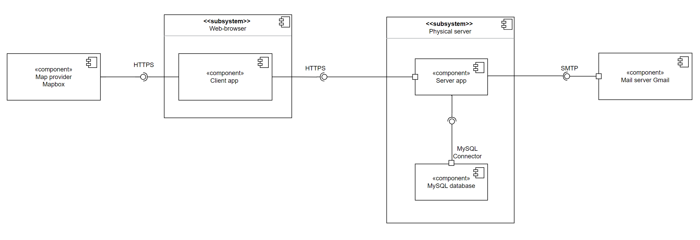
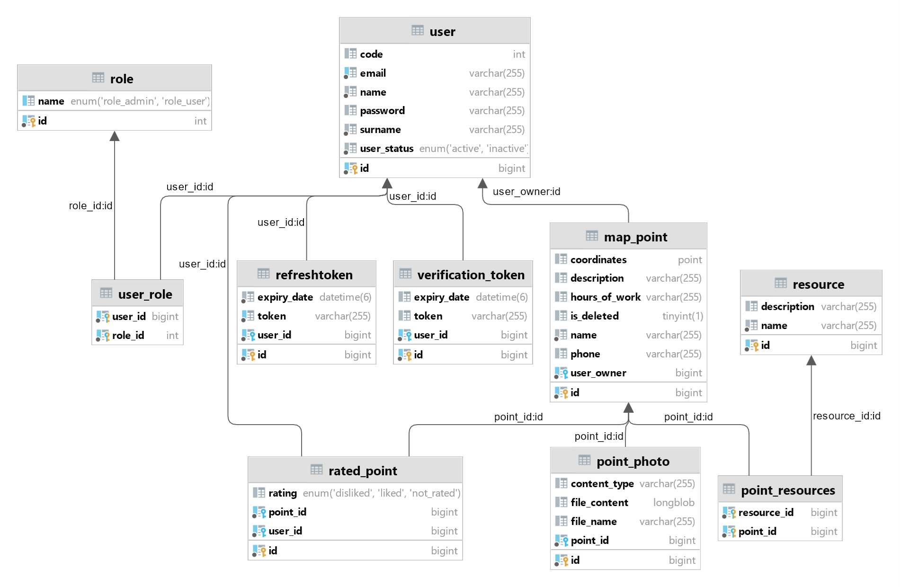
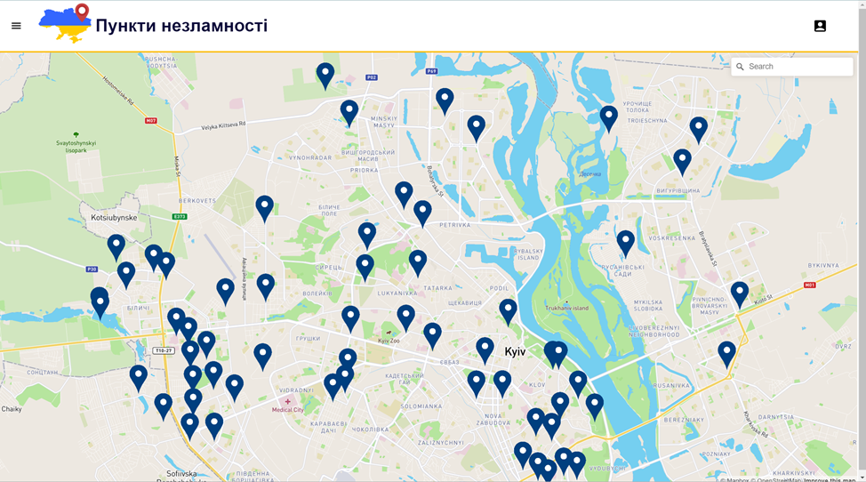
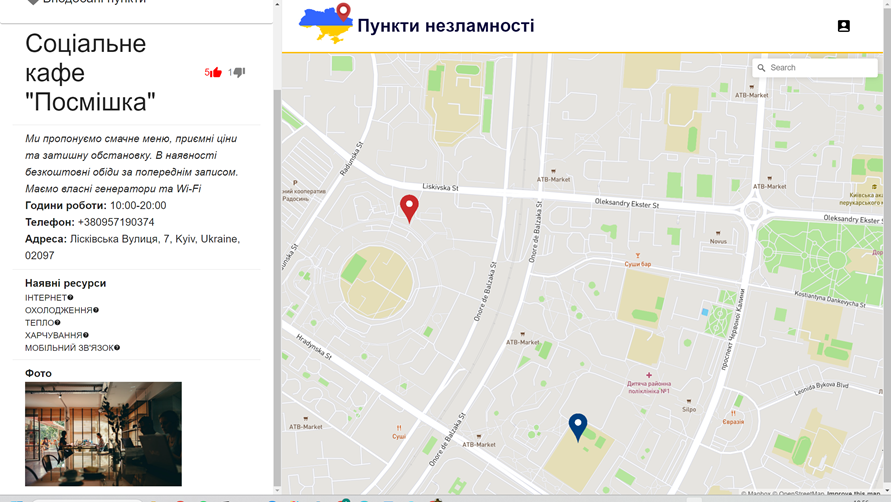
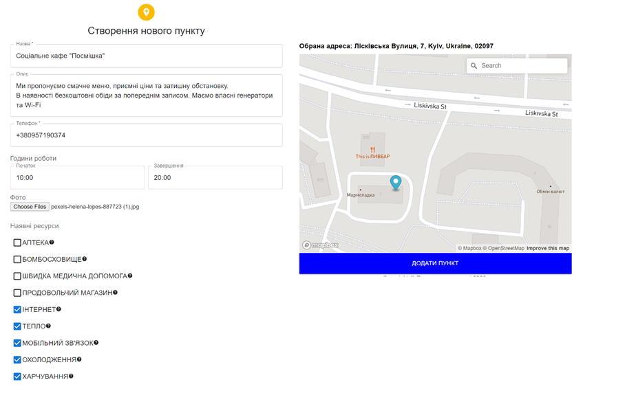
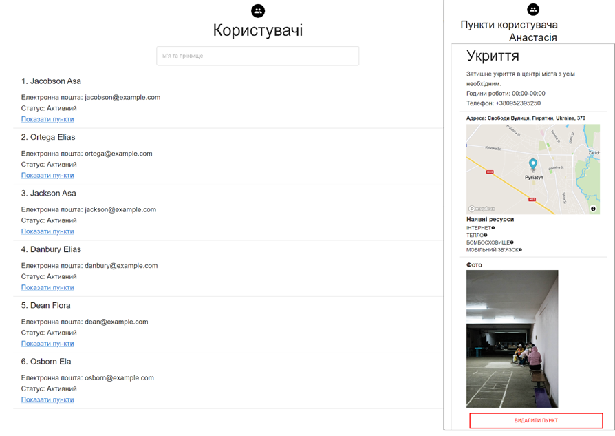

# System of informing the population about resources and life safety points
1. [Overview](#overview)
    * [Requirements](#requirements)
    * [Architecture](#architecture)
    * [Technology stack](#technology-stack)
    * [Database scheme](#database-scheme)
2. [Demonstration](#demonstration)
    * [Main page](#main-page)
    * [Point description](#point-description)
    * [Point creation](#point-creation)
    * [Admin Page](#admin-page)

## Overview

### Requirements
- Guest mode for viewing a map.
- There's an email-verified authorization system with password recovery.
- Authorized users can add points to the map. 
- Points have a rating system; users can like or dislike them. Points disliked over 20 times are hidden. 
- Administrators can manage users and their points on the map.

### Architecture

### Technology stack

### Database scheme

## Demonstration

### Main page

### Point description

### Point creation

### Admin Page
Managing users and their points on the map 
